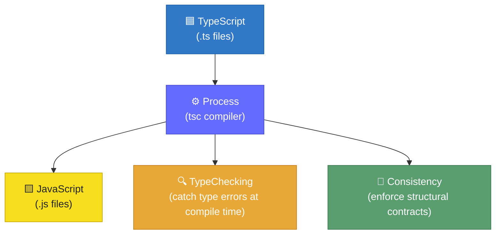
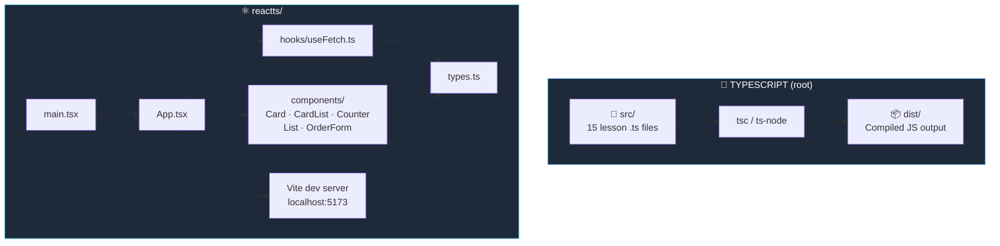

#  TypeScript Learning Repository


A structured, hands-on TypeScript learning repository covering core language concepts from fundamentals to advanced patterns, accompanied by a companion React + TypeScript frontend project built with Vite.

---

## 📖 Overview

This repository serves as a practical TypeScript reference and study guide. It contains two distinct parts:

- 📂 **`src/`** — A numbered sequence of TypeScript source files, each dedicated to a specific language concept (types, interfaces, generics, OOP, web requests, etc.), designed to be read and run in order.
- ⚛️ **`reactts/`** — A fully functional React application written in TypeScript, demonstrating real-world usage of TypeScript with React components, hooks, and API integration.

An architecture diagram (`TSCodeFlowD.drawio.pdf`) and a `playlist.txt` file are included alongside the source to guide the learning sequence.

---

## 🔄 How TypeScript Works — Compilation Pipeline

> Reconstructed from `TSCodeFlowD.drawio.pdf`

When you write TypeScript code, it passes through a **5-stage compiler pipeline** before producing JavaScript output:


| Stage | Role |
|---|---|
| **Lexer** | Tokenises raw TypeScript source into a flat stream of tokens |
| **Parser** | Builds an Abstract Syntax Tree (AST) from the token stream |
| **Binder** | Walks the AST and creates symbol tables, linking declarations to usages |
| **Checker** | Performs full type inference and type-checking across the bound AST |
| **Emitter** | Generates the final `.js` JavaScript, `.d.ts` declaration, and `.map` source-map files |

---

## ⚡ TypeScript → JavaScript Process Flow

> Reconstructed from `TSfLOW_drawio.pdf`

At a high level, TypeScript is a **processing layer** that sits between your source and the JavaScript runtime. The process also performs two parallel responsibilities:



- **TypeChecking** — The compiler validates that every value is used according to its declared type, catching bugs before runtime.
- **Consistency** — TypeScript enforces structural contracts across modules and interfaces, ensuring the codebase stays internally coherent as it grows.

---

## 📦 Using TypeScript with JavaScript Libraries

> From `explanation.js`

Many popular JavaScript libraries do not ship with built-in TypeScript type definitions. To use them with full type safety, install the library's `@types` package separately:

```bash
# 1. Install the library as usual
npm install some-library

# 2. Install the TypeScript type definitions as a dev dependency
npm install -D @types/some-library
```

The `@types/*` packages (maintained by the [DefinitelyTyped](https://github.com/DefinitelyTyped/DefinitelyTyped) community) provide TypeScript type definitions for JavaScript libraries that do not include them natively.

**Examples:**

```bash
npm install express
npm install -D @types/express

npm install lodash
npm install -D @types/lodash
```

---

## 🗂️ Repository Structure

```
TYPESCRIPT/
├── dist/                        # Compiled JavaScript output
├── node_modules/                # Root-level Node dependencies
├── reactts/                     # React + TypeScript companion app
│   ├── public/                  # Static assets
│   ├── src/
│   │   ├── assets/              # Images and static resources
│   │   ├── components/          # React components
│   │   │   ├── Card.tsx
│   │   │   ├── CardList.tsx
│   │   │   ├── Counter.tsx
│   │   │   ├── List.tsx
│   │   │   └── OrderForm.tsx
│   │   ├── hooks/
│   │   │   └── useFetch.ts      # Custom data-fetching hook
│   │   ├── App.css
│   │   ├── App.tsx
│   │   ├── index.css
│   │   ├── main.tsx
│   │   └── types.ts             # Shared TypeScript type definitions
│   ├── .gitignore
│   ├── eslint.config.js
│   ├── index.html
│   ├── package.json
│   ├── tsconfig.app.json
│   ├── tsconfig.json
│   ├── tsconfig.node.json
│   └── vite.config.ts
├── src/                         # Core TypeScript lessons (numbered)
│   ├── 01index.ts               # Entry point / overview
│   ├── 02_typesInTS.ts          # Primitive and basic types
│   ├── 03_UnionAndany.ts        # Union types and `any`
│   ├── 04_unknown_any.ts        # `unknown` vs `any`
│   ├── 05_typeNarrowing.ts      # Type narrowing / type guards
│   ├── 06_moreTypes.ts          # Literal types, optional, etc.
│   ├── 07_interfaceTS.ts        # Interfaces
│   ├── 08_ObjectsTs.ts          # Typed objects
│   ├── 09_FunctionsTs.ts        # Function types and signatures
│   ├── 10_ArrayEnumTuples.ts    # Arrays, enums, and tuples
│   ├── 11_oop.ts                # Object-oriented programming in TS
│   ├── 12_InterfacesDetail.ts   # Advanced interface patterns
│   ├── 13_Generics.ts           # Generic types and functions
│   ├── 14_webReq.ts             # Web requests with typed responses
│   └── 15_fetchReq.ts           # Fetch API with TypeScript
├── .gitignore
├── explanation.js               # JS library @types usage guide
├── package.json                 # Root package configuration
├── package-lock.json
├── playlist.txt                 # Suggested study order
├── README.md
├── TSCodeFlowD.drawio.pdf       # TS compiler pipeline diagram
├── TSfLOW_drawio.pdf            # TS → JS process flow diagram
└── tsconfig.json                # Root TypeScript configuration
```

---

## 🛠️ Tech Stack

| Badge | Layer | Technology |
|---|---|---|
|  | Language | TypeScript |
|  | Frontend Framework | React 18 |
|  | Build Tool | Vite |
|  | Linting | ESLint |
|  | Package Manager | npm |
|  | Module System | ES Modules |

---

## ✅ Prerequisites


- **Node.js** v18 or higher
- **npm** v9 or higher

---

## ⚙️ Installation

### 1. Clone the repository

```bash
git clone https://github.com/mshahnawaz1202/Typescript.git
cd Typescript
```

### 2. Install root dependencies (for the TypeScript lesson files)

```bash
npm install
```

### 3. Install the React app dependencies

```bash
cd reactts
npm install
```

---

## 🚀 Running the Project

### 📘 TypeScript Lesson Files

Compile and run any lesson file from the root using `ts-node` or the TypeScript compiler:

```bash
# Compile all files to dist/
npx tsc

# Run a specific lesson file directly
npx ts-node src/01index.ts
npx ts-node src/13_Generics.ts
```

Or compile a single file:

```bash
npx tsc src/05_typeNarrowing.ts --outDir dist/
node dist/05_typeNarrowing.js
```

### ⚛️ React + TypeScript App (`reactts`)

```bash
cd reactts

# Start the development server
npm run dev

# Build for production
npm run build

# Preview the production build
npm run preview
```

> The development server starts at `http://localhost:5173` by default (Vite).

---

## 📚 TypeScript Lessons — What Each File Covers

| # | File | Topic |
|---|---|---|
| 01 | `01index.ts` | 🗂️ Introduction and entry point |
| 02 | `02_typesInTS.ts` | 🔤 Primitive types: `string`, `number`, `boolean` |
| 03 | `03_UnionAndany.ts` | 🔀 Union types (`string \| number`) and `any` |
| 04 | `04_unknown_any.ts` | ❓ Difference between `unknown` and `any` |
| 05 | `05_typeNarrowing.ts` | 🔍 Type guards, `typeof`, `instanceof` narrowing |
| 06 | `06_moreTypes.ts` | ➕ Literal types, optional chaining, nullish coalescing |
| 07 | `07_interfaceTS.ts` | 📐 Defining and using interfaces |
| 08 | `08_ObjectsTs.ts` | 📦 Typing plain objects |
| 09 | `09_FunctionsTs.ts` | 🔧 Typed function parameters and return values |
| 10 | `10_ArrayEnumTuples.ts` | 📋 Typed arrays, enums, and tuples |
| 11 | `11_oop.ts` | 🏛️ Classes, access modifiers, inheritance |
| 12 | `12_InterfacesDetail.ts` | 🔗 Interface extension, merging, implementation |
| 13 | `13_Generics.ts` | 🧬 Generic functions, classes, and constraints |
| 14 | `14_webReq.ts` | 🌐 Typing HTTP responses and web requests |
| 15 | `15_fetchReq.ts` | 📡 Using the Fetch API with TypeScript types |

---

## ⚛️ React App — Key Components

Located in `reactts/src/`:

| File | Type | Description |
|---|---|---|
| `components/Card.tsx` | 🃏 Component | Single card display component |
| `components/CardList.tsx` | 📋 Component | Renders a list of `Card` components |
| `components/Counter.tsx` | 🔢 Component | Stateful counter component |
| `components/List.tsx` | 📝 Component | Generic list component |
| `components/OrderForm.tsx` | 📄 Component | Typed form component |
| `hooks/useFetch.ts` | 🪝 Hook | Custom hook for typed API data fetching |
| `types.ts` | 🏷️ Types | Shared type/interface definitions used across components |
| `App.tsx` | 🌳 Root | Root application component |
| `main.tsx` | 🚪 Entry | Application entry point |

---

## 🏗️ Architecture

The repository is split into two independent sub-projects that share a common theme:



The `useFetch.ts` hook in the React app directly applies the concepts from `14_webReq.ts` and `15_fetchReq.ts` — bridging theory from the lesson files into a real project.

---

## 🔧 TypeScript Configuration

### Root (`tsconfig.json`)
Controls compilation of the `src/` lesson files. Output goes to `dist/`.

### React App (`reactts/`)
Uses Vite's recommended split tsconfig setup:

| File | Purpose |
|---|---|
| `tsconfig.app.json` | Browser / app code compilation settings |
| `tsconfig.node.json` | Vite config and Node tooling settings |
| `tsconfig.json` | References both of the above |

---

## 🗺️ Suggested Learning Order

Refer to `playlist.txt` in the root for the recommended study sequence. In general, follow the numeric prefixes in `src/`:

1. 🟢 Start with `01index.ts` for an overview
2. ➡️ Progress through `02` → `15` in order
3. ⚛️ After `13_Generics.ts`, explore the `reactts/` app to see TypeScript in a real React project
4. 🗺️ Open `TSCodeFlowD.drawio.pdf` to visualise the compiler pipeline
5. 🔄 Open `TSfLOW_drawio.pdf` to understand the TS → JS transformation process

---

## 🐛 Troubleshooting

**`Cannot find module 'typescript'` or `tsc: command not found`**
```bash
npm install           # from the repo root
npx tsc --version     # verify TypeScript is available
```

**Vite dev server not starting**
```bash
cd reactts
npm install           # ensure dependencies are installed
npm run dev
```

**Type errors on compilation**
Each lesson file is self-contained. If `tsc` reports errors across files, compile individual files or check that `tsconfig.json` includes only the intended `src/` directory.

**Library has no TypeScript types (`Could not find a declaration file for module '...'`)**
```bash
npm install -D @types/your-library
```

---

## 📄 License

No license file was detected in this repository. Contact the repository owner for usage terms.

---

<div align="center">

Made with ❤️ for learning TypeScript


</div>
